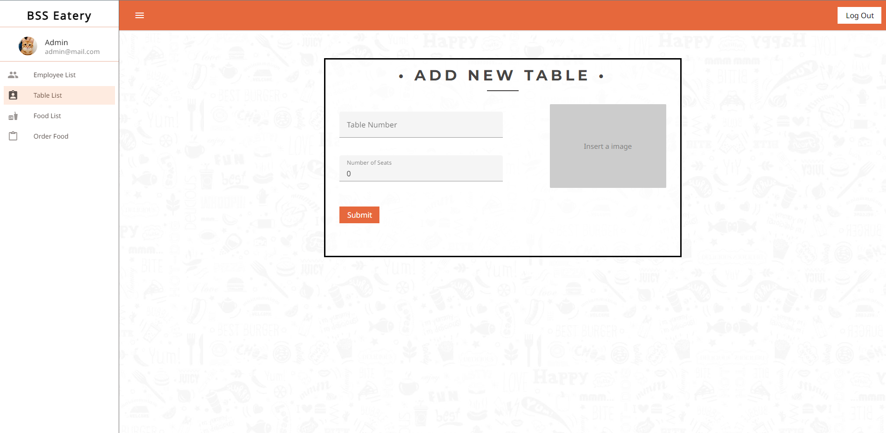
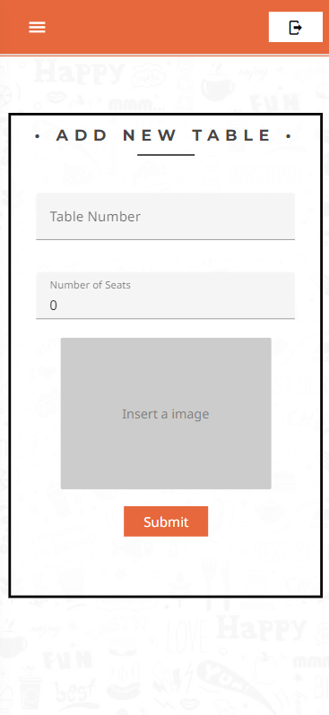
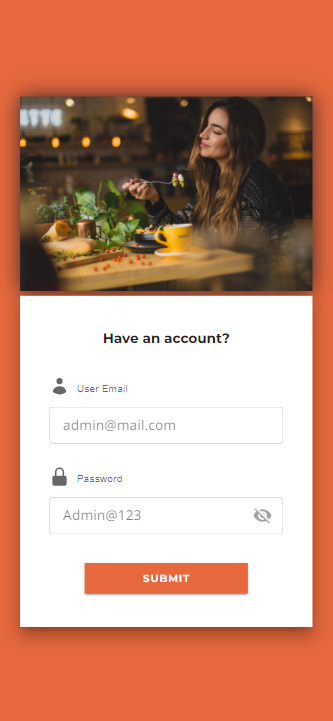
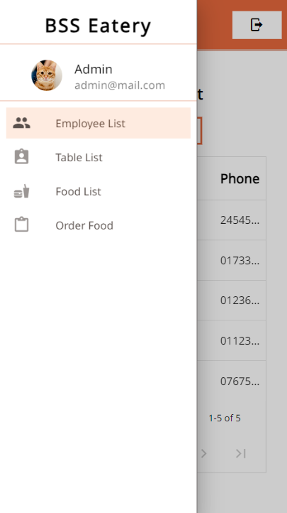

# BSS Resturant management

## Frontend
User Friendly online resturant management system with an admin role that allows adding new chef and waiters as well as assiging waiters to specific or multiple tables in the resturant. The frontend interface enables customers to effortlessly place orders and make table reservations according to their preferences. 

## Features

- User Login
- Employee management
- Resturant Table management
- Food Menu
- Order placement
- Admin Dashboard
- Responsive and User friendly design

## Tech Stack

**Client:** Vuejs, Vuetify, vue-router, axios, vuex

**Server:** C#

## Screenshots

     All responsive forms

     Table with text truncated

## Login Information
**email**: admin@mail.com

**password** Admin@123

## Live site : https://sunny-praline-a2263b.netlify.app/

